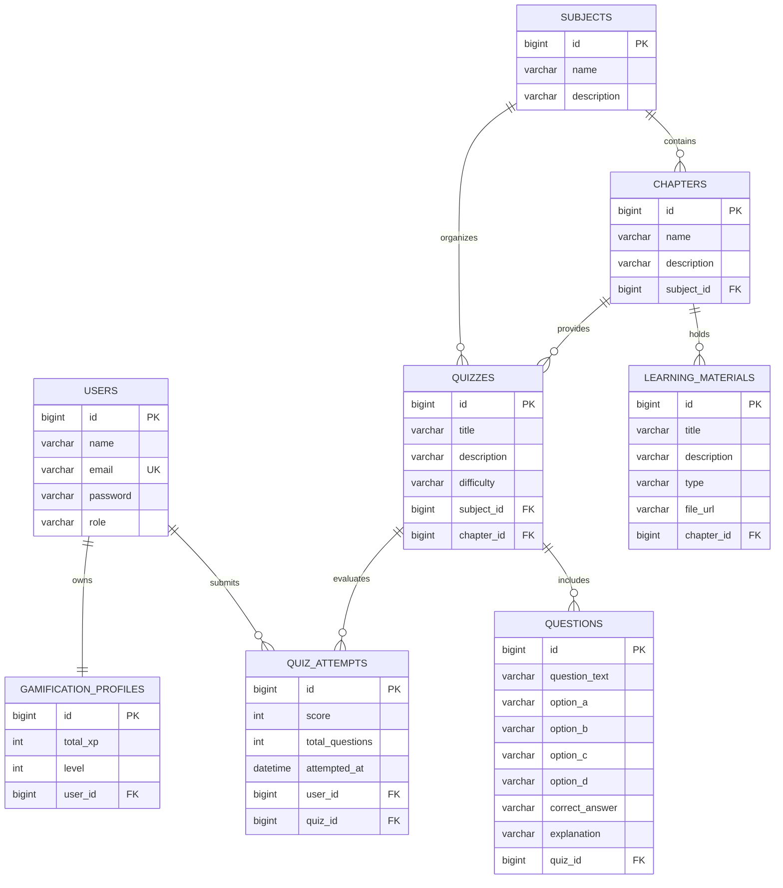

# Intelligent Gamified Learning Platform — Technical Documentation

**Department of Data Science — Mini-Project (Review 2)**  
**Batch**: 2026  
**Team 14 | Guide: Mrs. Y. Suguna**  

---

## 1. System Requirements & Domain Context
Higher education institutions face persistent challenges with student retention, conceptual mastery, and passive learning behaviors in core Computer Science subjects such as Data Structures, Database Systems, and Operating Systems. 

The **Intelligent Gamified Learning Platform** tackles these challenges by integrating:
1. **Hierarchical Academic Curriculum**: Structuring learning units into Subjects, Chapters, and Materials.
2. **Formative Assessment Arena**: Engaging multiple-choice quizzes providing immediate feedback.
3. **Adaptive Rule-Based Recommendation Engine**: Transparent, explainable recommendation logic analyzing quiz scoring patterns to steer students to high-priority revision resources.
4. **Motivational Gamification Dynamics**: Verifiable reward loops including Experience Points (XP), leveling tiers, milestone achievement badges, and campus rankings.

---

## 2. Security Architecture & RBAC Policy
The application enforces strict **Stateless Role-Based Access Control (RBAC)** implemented via Spring Security 6 and JSON Web Tokens (JWT).

### Roles & Responsibilities
- **`STUDENT`**:
  - Browse subjects, chapters, and curriculum materials.
  - Attempt quizzes, submit answers, receive graded results.
  - View personalized progress analytics and algorithmic recommendations.
  - Earn XP, achieve milestone badges, view campus leaderboard.
- **`ADMIN`**:
  - Full CRUD operations over subjects, chapters, materials, and multi-question quizzes.
  - Supervise academic curriculum integrity.

### Authentication Flow
1. User submits credentials to `POST /api/auth/login`.
2. `AuthServiceImpl` verifies credentials against BCrypt hashed passwords in `users` table.
3. `JwtUtil` issues a signed HMAC-SHA256 JWT containing subject email and granted authorities.
4. Client stores JWT in `localStorage` and attaches `Authorization: Bearer <token>` to all subsequent requests.
5. In the backend, `JwtFilter` validates the token per request and establishes the Spring Security `SecurityContext`.

---

## 3. Database Schema & Relational Model

---

## 4. Intelligent Recommendation Engine Specification

### Rationale & Design Philosophy
Rather than relying on uninterpretable "black-box" models or claiming unverified deep learning architectures, Review 2 employs a **deterministic, rule-based recommendation engine** that operates strictly on verified quiz performance data and provides **explainable reasoning** to the student. Advanced Machine Learning / LLMs remain designated as modular future enhancements.

### Decision Logic & Thresholds
Let $S$ represent the percentage score achieved on a quiz attempt ($S = \frac{\text{score}}{\text{totalQuestions}} \times 100$):

| Score Range | Priority Level | Recommendation Triggered | Action Route |
|:---|:---|:---|:---|
| $S < 60\%$ | **HIGH** | "Foundational Revision Required" — Concept review of parent chapter materials recommended before re-attempting. | `/subjects/{subjectId}` |
| $60\% \le S \le 69\%$ | **MEDIUM** | "Reinforce Core Concepts" — Targeted material review recommended followed by a practice retake. | `/quizzes/{quizId}` |
| $70\% \le S \le 84\%$ | **LOW** | "Good Progress" — Additional practice recommended to attain mastery level. | `/quizzes/{quizId}` |
| $S \ge 85\%$ | **ADVANCED** | "Mastery Demonstrated" — Recommendation to advance to harder difficulty or next curriculum subject. | `/quizzes` or `/subjects` |
| $\text{Attempts} = 0$ | **MEDIUM** | "Diagnostic Baseline" — Suggests taking the first assessment to establish a benchmark. | `/quizzes` |

---

## 5. Gamification Mechanics & Milestone Verification

### XP & Level Progression Formula
- **Base XP**: Every correct answer awards $+10\text{ XP}$.
- **Level Calculation**:
  $$\text{Level} = \left\lfloor \frac{\text{Total XP}}{100} \right\rfloor + 1$$
- **Rank Tiers**:
  - $\text{Level } 1 - 2$: **Beginner**
  - $\text{Level } 3 - 4$: **Intermediate**
  - $\text{Level } 5 - 9$: **Expert**
  - $\text{Level } \ge 10$: **Master**

### Milestone Badge Rules
All milestone achievements are dynamically calculated by `GamificationServiceImpl.getMyBadges()` and verified against historical `quiz_attempts` records:
1. **First Steps (`first_steps`)**: $\text{count}(\text{attempts}) \ge 1$.
2. **Perfect Score (`perfect_score`)**: $\exists a \in \text{attempts} \text{ where } a.\text{score} = a.\text{totalQuestions}$.
3. **Century Scholar (`century_scholar`)**: $\text{profile.totalXp} \ge 100$.
4. **Quiz Explorer (`quiz_explorer`)**: $\text{distinct}(\text{subjects attempted}) \ge 3$.
5. **High Achiever (`high_achiever`)**: $\text{count}(\text{attempts}) \ge 5$.
6. **Consistent Learner (`consistent_learner`)**: $\text{distinct}(\text{calendar days attempted}) \ge 2$.

---

## 6. End-to-End Verification Test Results

| Test Scenario | Input / Action | Expected Result | Actual Result | Status |
|:---|:---|:---|:---|:---:|
| Backend Compilation | `.\mvnw.cmd test-compile` | 0 syntax/compilation errors | Build Success (4.1s) | **PASS** |
| Frontend Compilation | `npm run build` | 0 bundle/syntax errors | Build Success (606ms) | **PASS** |
| CORS Configuration | Origin `http://localhost:5173` | Allowed with credentials | Headers returned | **PASS** |
| Admin RBAC Protection | Student calling `POST /api/subjects` | HTTP 403 Forbidden | Blocked with 403 | **PASS** |
| Answer Masking | `GET /api/quizzes/{id}` | `correctAnswer` omitted | Answers masked | **PASS** |
| Server-Side Grading | `POST /api/quizzes/3/submit` | Exact score calculated | Score: 3/3 (100%) | **PASS** |
| XP Award | Quiz submit with 3/3 | $+30\text{ XP}$ awarded | Profile XP updated | **PASS** |
| Level-Up Event | Reaching 100 XP | Promoted to Level 2 | Level 2 & Modal | **PASS** |
| Quiz Explorer Badge | Quizzes in Java, DBMS, OS | 3/3 subjects unlocked | Unlocked: True | **PASS** |
| Leaderboard Podium | `GET /api/gamification/leaderboard` | Top 3 podium + ranks | Jyothi V #1 (100 XP) | **PASS** |
| Recommendations | Low score attempt (<60%) | High Priority revision | Triggered correctly | **PASS** |
