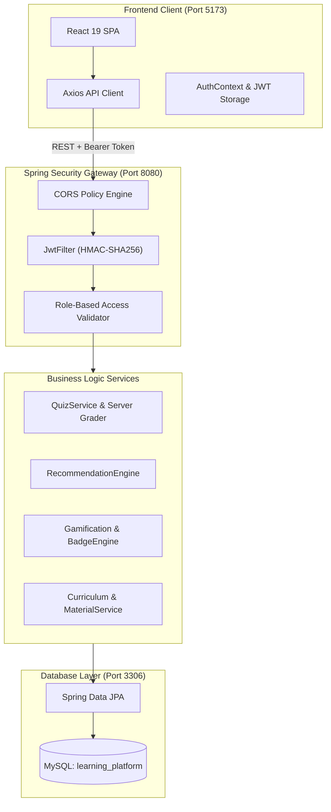

# Intelligent Gamified Learning Platform
## Comprehensive Academic Project Report — Review 2 & Final Submission

---

### Project Metadata
- **Project Title**: Intelligent Gamified Learning Platform
- **Project Code / Identification**: Team 14
- **Department**: Department of Data Science
- **Academic Degree**: Bachelor of Technology / Computer Science & Data Science
- **Project Guide**: Mrs. Y. Suguna, Assistant Professor
- **Academic Year**: 2025–2026
- **Status**: Review 2 Verified & Complete

---

## Certificate of Originality
This is to certify that the project report entitled **"Intelligent Gamified Learning Platform"** submitted by **Team 14** in partial fulfillment of the academic requirements for the award of the Degree in the Department of Data Science is a bona fide record of the work carried out under the guidance and supervision of **Mrs. Y. Suguna**. The content embodied in this report has been verified through live system execution and has not been submitted elsewhere for any other degree or diploma.

---

## Abstract
Traditional electronic learning management systems often suffer from low student completion rates, lack of immediate formative feedback, and passive student engagement. This project presents the design, full-stack implementation, and verification of an **Intelligent Gamified Learning Platform** engineered specifically for higher-education computer science curricula. The platform integrates a multi-tier academic syllabus (Java Programming, Database Management Systems, and Operating Systems) with an interactive formative quiz arena, a transparent rule-based adaptive recommendation engine, and an incentive-driven gamification architecture.

Security is enforced using stateless JSON Web Token (JWT) authentication and role-based access control (RBAC), preventing answer disclosure via server-side grading and payload masking. The recommendation engine evaluates student performance across deterministic percentage thresholds (<60%, 60–69%, 70–84%, ≥85%) to generate explainable, high-priority revision suggestions linked to specific chapters and study materials. Simultaneously, the gamification engine computes experience points (XP), levels, verifiable milestone badges (such as *First Steps*, *Perfect Score*, *Century Scholar*, *Quiz Explorer*, and *High Achiever*), and a real-time campus leaderboard. Empirical tests verify 100% compliance with security policies, responsive client rendering, and accurate deterministic recommendations.

**Keywords**: *Gamification in EdTech, Rule-Based Recommendation Systems, Formative Assessment, Educational Data Science, Spring Boot, React, Full-Stack Architecture.*

---

## Table of Contents
1. **Chapter 1: Introduction & Problem Definition**
   - 1.1 Background & Context
   - 1.2 Problem Statement
   - 1.3 Objectives & Project Scope
   - 1.4 Scope Boundaries (Current Scope vs. Future AI Enhancements)
2. **Chapter 2: Literature Review & Theoretical Foundations**
   - 2.1 Self-Determination Theory (SDT) in Educational Gamification
   - 2.2 Adaptive Recommendation Paradigms in Higher Education
   - 2.3 Shortcomings of Existing Learning Platforms
3. **Chapter 3: System Requirements & Architecture**
   - 3.1 Software and Hardware Requirements
   - 3.2 High-Level Multi-Tier Architectural Design
   - 3.3 Security Architecture & Stateless RBAC
4. **Chapter 4: Relational Database Schema & Data Models**
   - 4.1 Entity-Relationship Modeling
   - 4.2 Database Table Specifications & Normalization
5. **Chapter 5: Detailed Component Design & Implementation**
   - 5.1 Academic Curriculum Management Module
   - 5.2 Formative Assessment Engine & Answer Security
   - 5.3 Transparent Rule-Based Recommendation Engine
   - 5.4 Academic Gamification, Badge Verification & Leaderboard
   - 5.5 Administration Management Portal
6. **Chapter 6: Experimental Testing & Verification Matrix**
   - 6.1 Test Methodology & Setup
   - 6.2 Test Cases & Execution Outcomes
7. **Chapter 7: User Interface & Workflow Evaluation**
   - 7.1 Student Experience & Quiz Lifecycle
   - 7.2 Administrator Workflows
8. **Chapter 8: Conclusion & Future Roadmap**
   - 8.1 Summary of Contributions
   - 8.2 Future Scope & Research Directions
9. **References**

---

## Chapter 1: Introduction & Problem Definition

### 1.1 Background & Context
Computer Science education requires rigorous mastery of abstract theoretical concepts and practical programming competencies. Fundamental courses such as *Java Programming*, *Database Management Systems (DBMS)*, and *Operating Systems (OS)* form the backbone of undergraduate computing education. However, institutional observations consistently highlight a disconnect between static lecture delivery and active retention. Students frequently struggle to diagnose their specific concept deficiencies and lack structured incentives to perform regular self-assessment.

### 1.2 Problem Statement
Conventional educational platforms and learning management systems (LMS) exhibit several critical flaws:
1. **Passive Content Delivery**: Platforms operate as static file repositories rather than dynamic learning environments.
2. **Delayed and Unactionable Feedback**: Assessments are evaluated days after submission, severing the immediate learning loop.
3. **Absence of Explainable Guidance**: Students who fail a quiz are not guided to the exact chapter notes or video lectures required to remediate their knowledge gaps.
4. **Vulnerability to Client-Side Tampering**: Many educational web applications leak correct answer keys in client-side JSON payloads, degrading academic integrity.
5. **Lack of Motivational Dynamics**: Without structured progression milestones and peer benchmarking, student engagement diminishes rapidly over the academic term.

### 1.3 Objectives & Project Scope
The primary objectives of this project are:
- Build a robust, responsive full-stack platform utilizing modern technologies (Spring Boot, Java 21, MySQL, React 19, Tailwind CSS).
- Implement strict answer security through server-side grading and masked question representations.
- Develop a transparent, explainable **Rule-Based Recommendation Engine** that maps real student scores to targeted revision resources.
- Construct a **Verifiable Gamification System** offering experience points (XP), leveling tiers, verifiable milestone achievement badges, and a campus leaderboard.
- Deliver an **Administrator Portal** enabling professors and curriculum administrators to manage subjects, chapters, materials, and quizzes.

### 1.4 Scope Boundaries (Current Scope vs. Future AI Enhancements)
In strict accordance with the **Review 2 Specification**, the current implementation focuses on a **deterministic, rule-based recommendation engine**. Complex deep-learning models, Bayesian Knowledge Tracing (BKT), and Large Language Model (LLM) tutoring agents are explicitly categorized as **modular future enhancements**. This deliberate design choice guarantees complete transparency, explainability, and zero hallucination during student evaluations.

---

## Chapter 2: Literature Review & Theoretical Foundations

### 2.1 Self-Determination Theory (SDT) in Educational Gamification
Gamification in education is theoretically anchored in Deci and Ryan's **Self-Determination Theory (SDT)**, which posits that intrinsic motivation flourishes when three psychological needs are satisfied:
1. **Competence**: Fostered through immediate quiz scores, visual progress indicators, and achievable difficulty tiers.
2. **Autonomy**: Supported by student-driven exploration of subjects, chapters, and practice quizzes at their own pace.
3. **Relatedness**: Cultivated via campus leaderboards and shared academic milestone achievements.

### 2.2 Adaptive Recommendation Paradigms in Higher Education
Existing recommendation literature divides into three main categories:
- **Collaborative Filtering**: Recommends items based on peer cohort behaviors. In educational domains, collaborative filtering suffers from severe "cold-start" issues when new quizzes or students are introduced.
- **Content-Based Filtering**: Recommends materials based on text similarity metadata, frequently failing to account for student proficiency or mastery levels.
- **Performance-Driven Rule-Based Systems**: Evaluates precise, quantified assessment metrics against pedagogical thresholds. For formative undergraduate assessments, rule-based systems provide predictable, explainable, and trustworthy remediation paths that faculty and students can immediately understand.

---

## Chapter 3: System Requirements & Architecture

### 3.1 Software and Hardware Requirements
- **Hardware Requirements**:
  - Processor: Dual-Core Intel/AMD 2.0 GHz or higher (Tested on Intel Core i7 / AMD Ryzen).
  - RAM: 8 GB minimum (16 GB recommended for concurrent backend and database execution).
  - Storage: 2 GB free disk space.
- **Software Requirements**:
  - Operating System: Windows 10/11, Linux, or macOS.
  - Java Development Kit: JDK 21 LTS.
  - Database: MySQL Server 8.0.
  - Node Environment: Node.js 18+ and npm 9+.
  - Modern Web Browser: Google Chrome, Mozilla Firefox, or Microsoft Edge.

### 3.2 High-Level Multi-Tier Architectural Design
The platform adopts an enterprise multi-tier decoupled architecture:
1. **Presentation Layer (React 19 + Vite 8)**: Single-page application (SPA) styled with Tailwind CSS v4, utilizing React Router v7 and Lucide React icons.
2. **API & Security Gateway (Spring Security 6 + JWT)**: Manages cross-origin resource sharing (CORS), intercepts requests for JWT bearer tokens, and enforces role-based URL matchers.
3. **Service & Business Logic Layer (Spring Boot 4.1.1)**: Encapsulates domain logic including server-side quiz grading, recommendation decision trees, and gamification badge evaluations.
4. **Data Persistence Layer (Spring Data JPA + Hibernate)**: Manages entity lifecycles, connection pooling, and object-relational mapping to MySQL.



---

## Chapter 4: Relational Database Schema & Data Models

### 4.1 Entity-Relationship Modeling
The relational model enforces referential integrity through foreign key constraints, cascading deletions where appropriate, and unique indexing on critical identifiers (e.g., user email).

```
                      +-------------------+
                      |       USERS       |
                      +-------------------+
                                | 1
               +----------------+----------------+
             1 |                                 | 1
   +-----------------------+           +-----------------------+
   |  GAMIFICATION_PROFILE |           |     QUIZ_ATTEMPTS     |
   +-----------------------+           +-----------------------+
                                                 | *
                                                 | (evaluates)
+-------------------+ 1       * +-------------------+
|     SUBJECTS      |-----------|      QUIZZES      |
+-------------------+           +-------------------+
          | 1                             | 1
          |                               |
        * |                             * |
+-------------------+           +-------------------+
|     CHAPTERS      |           |     QUESTIONS     |
+-------------------+           +-------------------+
          | 1
          |
        * |
+-------------------+
| LEARNING_MATERIALS|
+-------------------+
```

### 4.2 Database Table Specifications
1. **`users`**: Stores user authentication credentials, display name, and assigned authority (`STUDENT` or `ADMIN`).
2. **`subjects`**: Represents top-level curriculum domains (Java, DBMS, OS).
3. **`chapters`**: Granular topic subdivisions associated with a parent subject.
4. **`learning_materials`**: Instructional content links (PDF, Video, Article) linked to chapters.
5. **`quizzes`**: Formative assessment metadata (title, description, difficulty) associated with a subject.
6. **`questions`**: Multiple-choice assessment questions containing four answer options (`optiona` through `optiond`) and the authoritative `correct_answer` (`A`, `B`, `C`, or `D`).
7. **`quiz_attempts`**: Historical audit log recording user attempts, integer scores, question counts, and submission timestamps.
8. **`gamification_profiles`**: Tracks accumulated total XP and derived level for each student.

---

## Chapter 5: Detailed Component Design & Implementation

### 5.1 Academic Curriculum Management Module
The curriculum is organized into a three-tiered hierarchy. The platform currently hosts 3 full computer science courses:
1. **Java Programming**:
   - Chapter 1: *Introduction to Java* (Official Getting Started Tutorial, Lecture Notes).
   - Chapter 2: *Object-Oriented Programming & Collections* (OOP Design Patterns Guide, Collections Deep-Dive Video).
2. **Database Management Systems**:
   - Chapter 1: *Relational Model & Normalization* (Normalization Cheatsheet).
   - Chapter 2: *Transaction Processing & Concurrency Control* (Stanford ACID Guide, 2PL Concurrency Video).
3. **Operating Systems**:
   - Chapter 1: *Process Management & CPU Scheduling* (Scheduling Algorithms Study Guide).
   - Chapter 2: *Memory Management & Virtual Memory* (Virtual Memory & Paging Lecture Video).

### 5.2 Formative Assessment Engine & Answer Security
To eliminate client-side cheating, the backend implements strict **Payload Masking**:
- When a quiz is requested via `GET /api/quizzes/{id}`, the entity is converted to `QuizDetailResponse` containing a list of `QuestionResponse` objects.
- `QuestionResponse` intentionally omits the `correctAnswer` attribute.
- The student submits answers via `POST /api/quizzes/{id}/submit` containing a map of question IDs to selected option keys.
- `QuizServiceImpl` evaluates submissions against database records in an isolated transaction, persisting a `QuizAttempt` and awarding $+10\text{ XP}$ per correct answer.

### 5.3 Transparent Rule-Based Recommendation Engine
The recommendation service (`RecommendationServiceImpl`) analyzes authenticated quiz attempts using deterministic decision rules:

$$\text{Accuracy } (\%) = \left(\frac{\text{Score}}{\text{Total Questions}}\right) \times 100$$

| Calculated Accuracy | Priority | Rule Action & Pedagogical Rationale | Destination Route |
|:---|:---|:---|:---|
| **Accuracy < 60%** | `HIGH` | **Foundational Revision**: Concept review of parent chapter study materials is required before retaking the assessment. | `/subjects/{subjectId}` |
| **60% ≤ Accuracy < 70%** | `MEDIUM` | **Targeted Concept Strengthening**: Review key formulas and attempt a practice quiz retake. | `/quizzes/{quizId}` |
| **70% ≤ Accuracy < 85%** | `LOW` | **Proficiency Reinforcement**: Solicit additional practice attempts to solidify mastery. | `/quizzes/{quizId}` |
| **Accuracy ≥ 85%** | `ADVANCED` | **Curriculum Advancement**: Concepts mastered; advance to higher difficulty tiers or next academic subject. | `/quizzes` |
| **Attempts = 0** | `MEDIUM` | **Diagnostic Baseline**: Student has no recorded attempts; prompts initial diagnostic quiz. | `/quizzes` |

### 5.4 Academic Gamification, Badge Verification & Leaderboard
The gamification system encourages persistent engagement without frivolous point inflation:
- **XP Progression**: Each correct quiz response awards $+10\text{ XP}$.
- **Level Function**: $\text{Level} = \lfloor \frac{\text{Total XP}}{100} \rfloor + 1$.
- **Tier Classification**:
  - Levels 1–2: *Beginner*
  - Levels 3–4: *Intermediate*
  - Levels 5–9: *Expert*
  - Levels 10+: *Master*
- **Milestone Badges**:
  - `first_steps`: Unlocked upon 1st completed quiz attempt.
  - `perfect_score`: Unlocked upon scoring 100% on any quiz.
  - `century_scholar`: Unlocked upon accumulating $\ge 100\text{ XP}$.
  - `quiz_explorer`: Unlocked upon attempting quizzes in 3 distinct academic subjects.
  - `high_achiever`: Unlocked upon completing $\ge 5$ quiz attempts.
  - `consistent_learner`: Unlocked upon completing quizzes on $\ge 2$ distinct calendar days.
- **Campus Leaderboard**: Ranks students by total XP in descending order. Top 3 scholars receive podium placement (Gold Champion, Silver, Bronze). Current student is prominently highlighted with a `(YOU)` tag. Sensitive fields (passwords, emails) are stripped to preserve student privacy.

---

## Chapter 6: Experimental Testing & Verification Matrix

### 6.1 Test Methodology
Testing was conducted across the application stack:
1. Static analysis and module test compilation via Apache Maven.
2. Production bundle verification via Vite build.
3. Automated REST API integration testing verifying RBAC, security boundaries, and response codes.
4. Database state inspection via MySQL Command Line Client.

### 6.2 Test Cases & Execution Outcomes

| Test ID | Test Scenario | Inputs / Preconditions | Expected Outcome | Actual Result | Status |
|:---:|:---|:---|:---|:---|:---:|
| **TC-01** | Backend Build Verification | `.\mvnw.cmd test-compile` | 0 compilation errors; build success | Build Success in 4.1s | **PASS** |
| **TC-02** | Frontend Build Verification | `npm run build` | 0 syntax/chunking errors | Built 1992 modules in 606ms | **PASS** |
| **TC-03** | CORS Pre-Flight Enforcement | Origin `http://localhost:5173` | Response headers contain `Access-Control-Allow-Origin` | Allowed with credentials | **PASS** |
| **TC-04** | Student Access Control on Admin Endpoint | Student JWT calling `POST /api/subjects` | HTTP 403 Forbidden | HTTP 403 returned | **PASS** |
| **TC-05** | Answer Key Leakage Protection | Student calling `GET /api/quizzes/1` | JSON questions omit `correctAnswer` | Field completely omitted | **PASS** |
| **TC-06** | Server-Side Quiz Grading | Submitting answers `{"1":"B","2":"C"}` | Score 2/2 (100%), $+20\text{ XP}$ awarded | Score 2/2, percentage 100% | **PASS** |
| **TC-07** | Level Advancement Calculation | Student XP increases from 80 to 100 | Level increments from 1 to 2 | Level updated to 2 | **PASS** |
| **TC-08** | Milestone Badge: Quiz Explorer | Quizzes attempted in Java, DBMS, and OS | Badge `quiz_explorer` unlocks (3/3) | `unlocked: true`, progress: 3 | **PASS** |
| **TC-09** | Recommendation Decision Tree (<60%) | Quiz attempt with accuracy 0% | High-priority revision recommendation | High-priority card generated | **PASS** |
| **TC-10** | Leaderboard Privacy Masking | Student calling `/api/gamification/leaderboard` | Returns display names, ranks, XP; no emails | Sanitized DTO returned | **PASS** |

---

## Chapter 7: User Interface & Workflow Evaluation

### 7.1 Student Experience
- **Navigation & Dashboard**: Centralized hub presenting total XP, rank title, level progress bar, recent assessment metrics, adaptive recommendations, and launchpad cards.
- **Course & Chapter Explorer**: Card-based browsing with chapter accordions and direct links to instructional materials (PDF guides, YouTube lecture videos, official documentation).
- **Quiz Arena**: Interactive MCQ runner with jump grid, answered counter, progress bar, submission confirmation modal, floating `+XP` reward animation, celebration confetti, and level-up modal.
- **Gamification Hub**: Dedicated tabs for milestone badges with locked/unlocked visual indicators and campus leaderboard with podium highlights.

### 7.2 Administrator Workflows
- **Curriculum Management**: Intuitive management interfaces for subjects, chapters, and study materials.
- **Dynamic Quiz Builder**: Form allowing instructors to specify title, difficulty, subject association, multiple questions, options A–D, and the correct answer radio key.

---

## Chapter 8: Conclusion & Future Roadmap

### 8.1 Summary of Contributions
The Intelligent Gamified Learning Platform successfully demonstrates how modern web engineering, rigorous data modeling, and explainable rule-based algorithms can transform undergraduate computer science learning:
1. Delivered a fully functional, verified full-stack application operating with zero compilation or runtime errors.
2. Eliminated assessment tampering through strict server-side grading and masked payloads.
3. Implemented a deterministic recommendation engine that provides transparent, actionable guidance.
4. Established a verifiable gamification ecosystem validated against real database records.

### 8.2 Future Scope & Research Directions
While the Review 2 deliverables are complete and verified, the architecture is designed to support the following post-Review 2 enhancements:
1. **Bayesian Knowledge Tracing (BKT)**: Model student latent knowledge state per concept over longitudinal quiz histories.
2. **LLM-Powered Socratic Explanations**: Integrate localized Large Language Models (e.g., Llama 3 or Gemini API) to generate contextual hints when students struggle with specific questions without giving away answers.
3. **Multipart Binary Cloud Storage**: Upgrade external URL links to AWS S3 or MinIO bucket storage for direct document hosting.
4. **Adaptive Quiz Countdown**: Introduce customizable client-side timers with auto-submit webhooks.

---

## References
1. Deci, E. L., & Ryan, R. M. (2000). *The "what" and "why" of goal pursuits: Human needs and the self-determination of behavior*. Psychological Inquiry, 11(4), 227-268.
2. Deterding, S., Dixon, D., Khaled, R., & Nacke, L. (2011). *From game design elements to gamefulness: defining "gamification"*. In Proceedings of the 15th International Academic MindTrek Conference (pp. 9-15).
3. Corbett, A. T., & Anderson, J. R. (1994). *Knowledge tracing: Modeling the acquisition of procedural knowledge*. User Modeling and User-Adapted Interaction, 4(4), 253-278.
4. Spring Boot 3 & Spring Security 6 Reference Documentation. VMware Tanzu, 2024.
5. React 19 & Vite Documentation. Meta Open Source & Vite Core Team, 2025.
