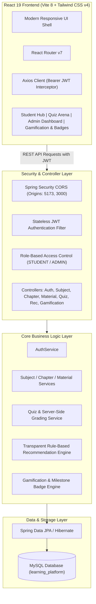

# Intelligent Gamified Learning Platform

**Department of Data Science — College Mini-Project (Review 2 & Final Submission)**  
**Project Team**: Team 14  
**Project Guide**: Mrs. Y. Suguna  

---

## 📌 Executive Overview

The **Intelligent Gamified Learning Platform** is an enterprise-grade full-stack EdTech web application engineered to enhance student engagement and academic outcomes in higher education. Combining structured academic curriculum management with a performance-driven recommendation engine and a gamification system, the platform empowers students to master core computer science subjects (Java Programming, Database Management Systems, Operating Systems) while earning experience points (XP), leveling up, and unlocking milestone achievement badges.

---

## 🏗️ System Architecture & Tech Stack



### Technology Matrix
- **Backend**: Spring Boot 4.1.1, Java 21, Spring Security 6, Spring Data JPA, jjwt (0.11.5)
- **Database**: MySQL 8.0 on port 3306 (InnoDB engine, foreign key constraints)
- **Frontend**: React 19, Vite 8, Tailwind CSS v4, React Router v7, Lucide React, Canvas-Confetti
- **Build Tools**: Apache Maven (`mvnw`), Node.js & npm

---

## 🚀 Key Modules & Capabilities

### 1. Security & Authentication
- Stateless JSON Web Token (JWT) authentication with BCrypt password hashing.
- Role-Based Access Control (RBAC) strictly separating `STUDENT` and `ADMIN` privileges.
- All non-public endpoints require validated Bearer tokens; admin endpoints block student requests with `403 Forbidden`.

### 2. Academic Curriculum Hierarchy & Standardized Structure
- **4 Core Subjects**: Java Programming, Database Management Systems, Operating Systems, Software Engineering.
- **Strict 3 Chapters Per Subject (12 Total)**: Structured in logical pedagogical order from fundamentals to intermediate concepts and advanced architectural topics.
- **3 Standardized Resources Per Chapter (36 Total)**:
  1. **Detailed Notes PDF**: Comprehensive academic notes covering syntax, definitions, code examples, and architecture (served at `/notes/*_detailed_notes.pdf`).
  2. **Quick Revision Notes PDF**: Concise revision cheat sheets with high-yield bullet points, formulas, and key summaries (served at `/notes/*_revision_notes.pdf`).
  3. **YouTube Masterclass Lecture**: Curated, verified lecture link with interactive in-app modal video player.

### 3. Interactive Quiz Arena & Chapter-Wise Quizzes
- **Chapter-Wise 3-Tier Quizzes (36 Total, 264 Questions)**: Every chapter provides dedicated quizzes across all three difficulty tiers:
  - **Easy Tier**: 5 Questions · 5 Minutes · 50 Max XP (+10 XP per correct question).
  - **Medium Tier**: 7 Questions · 10 Minutes · 70 Max XP (+10 XP per correct question).
  - **Hard Tier**: 10 Questions · 15 Minutes · 100 Max XP (+10 XP per correct question).
- **Strict Answer Masking**: Question DTOs exclude `correctAnswer` from student responses, preventing inspection.
- **Server-Side Grading & Explanations**: Submissions evaluate score, percentage, verified XP rewards, and return detailed technical explanations for every question.
- **Filter by Subject & Chapter**: Quizzes page allows seamless filtering by Subject, Chapter, and Difficulty tier.

### 4. Transparent, Rule-Based Recommendation Engine
- Deterministic, verifiable rules analyzing authenticated students' quiz history:
  - **< 60% Score**: High-Priority revision triggered, directing student to specific chapter materials.
  - **60% – 69% Score**: Medium-Priority recommendation suggesting concept review and quiz retake.
  - **70% – 84% Score**: Low-Priority recommendation encouraging practice for mastery.
  - **≥ 85% Score**: Advancement recommendation suggesting progression to harder topics or next subjects.
  - **0 Attempts**: Diagnostic recommendation guiding the student to take their initial baseline quiz.
- Modular architecture allowing seamless future integration of ML/LLM pipelines.

### 5. Gamification, Badges & Campus Leaderboard
- **Experience Points (XP) & Levels**:
  - Formula: `Level = (Total XP / 100) + 1`
  - Titles: Beginner (Lv 1–2), Intermediate (Lv 3–4), Expert (Lv 5–9), Master (Lv 10+)
- **Milestone Badges (Real Database Verification)**:
  - 👣 **First Steps**: Complete first quiz attempt (1/1).
  - 🏆 **Perfect Score**: Score 100% on any quiz assessment (1/1).
  - 🔥 **Century Scholar**: Reach 100+ Total XP (100/100).
  - 🧭 **Quiz Explorer**: Attempt quizzes in 3 distinct subjects (Java, DBMS, OS).
  - 🎖️ **High Achiever**: Complete 5+ quiz attempts (5/5).
  - 📅 **Consistent Learner**: Complete quizzes across 2+ distinct calendar days.
- **Campus Leaderboard**: Real-time student ranking with Podium display for Top 3 (Gold, Silver, Bronze) and highlighted `(YOU)` row. Personal emails/credentials are masked for privacy.
- **Celebration UX**: Floating XP burst (`+XP`), particle sparks, and level-up modal with confetti (respects `prefers-reduced-motion`).

### 6. Administration Portal
- Comprehensive curriculum management for subjects, chapters, and materials.
- Interactive multi-question quiz builder with dynamic question addition, option inputs (A–D), and radio correct-answer selection.

---

## 📡 API Reference Matrix

| Method | Endpoint | Access Role | Description |
|:---|:---|:---|:---|
| `POST` | `/api/auth/register` | Public | Register new student or admin |
| `POST` | `/api/auth/login` | Public | Authenticate user & receive JWT token |
| `GET` | `/api/subjects` | STUDENT, ADMIN | List all academic subjects |
| `POST` | `/api/subjects` | ADMIN | Create new academic subject |
| `DELETE` | `/api/subjects/{id}` | ADMIN | Remove subject and cascade chapters |
| `GET` | `/api/chapters/subject/{id}` | STUDENT, ADMIN | Get chapters for specific subject |
| `POST` | `/api/chapters` | ADMIN | Create new chapter |
| `GET` | `/api/materials/chapter/{id}` | STUDENT, ADMIN | List materials for specific chapter |
| `POST` | `/api/materials` | ADMIN | Create study document/video link |
| `GET` | `/api/quizzes` | STUDENT, ADMIN | List quizzes (filterable by `subjectId`, `chapterId`, `difficulty`) |
| `GET` | `/api/quizzes/{id}` | STUDENT, ADMIN | Get quiz details & questions (masked answers) |
| `GET` | `/api/quizzes/chapter/{id}` | STUDENT, ADMIN | List quizzes belonging to a specific chapter |
| `POST` | `/api/quizzes` | ADMIN | Create multi-question quiz |
| `POST` | `/api/quizzes/{id}/submit` | STUDENT | Submit quiz answers & evaluate score |
| `GET` | `/api/recommendations/me` | STUDENT, ADMIN | Retrieve personalized recommendations |
| `GET` | `/api/gamification/me` | STUDENT, ADMIN | Get current XP, level, and title |
| `GET` | `/api/gamification/badges` | STUDENT, ADMIN | Get milestone badges with unlock progress |
| `GET` | `/api/gamification/leaderboard` | STUDENT, ADMIN | Get student XP rankings & podium |
| `GET` | `/api/progress/me` | STUDENT | Get student total attempts and accuracy |

---

## 💻 Setup & Execution Guide

### Prerequisites
- Java JDK 21+
- Node.js 18+ and npm
- MySQL Server 8.0 running on localhost:3306

### Database Configuration
Ensure MySQL database `learning_platform` exists:
```sql
CREATE DATABASE IF NOT EXISTS learning_platform;
```
Configure credentials in `src/main/resources/application.properties` (defaults: `root` / `tiger`).

### Running the Backend
From the project root:
```powershell
.\mvnw.cmd spring-boot:run
```
The backend starts on `http://localhost:8080`.

### Running the Frontend
From the `frontend` directory:
```powershell
cd frontend
npm install
npm run dev
```
The frontend dev server starts on `http://localhost:5173`.

---

## 🔮 Future Enhancements (Beyond Review 2)
1. **Machine Learning / LLM Adaptation**: Incorporate Bayesian Knowledge Tracing (BKT) and Large Language Models (LLM) for generative explanation hints and adaptive question difficulty adjustments.
2. **Direct File Object Storage**: Upgrade external URL material links to AWS S3 / MinIO multipart binary file uploads.
3. **Timed Quiz Countdown**: Add real-time client countdown timers with auto-submission upon expiry.
