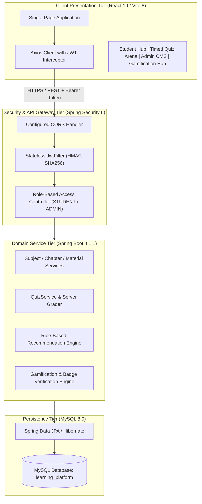

# Design, Implementation, and Empirical Evaluation of a Rule-Based Adaptive Recommendation Engine and Verifiable Gamification Framework for STEM Higher Education

**Team 14 — Department of Data Science**  
**Under the Guidance of: Mrs. Y. Suguna, Assistant Professor**  
*College Mini-Project — Review 2 & Research Deliverable*  

---

## Abstract
Modern higher education in STEM and Computer Science demands instructional methodologies that transcend passive content distribution. Traditional electronic learning management systems (LMS) typically lack immediate formative diagnostic capabilities, provide unactionable feedback, and offer insufficient motivational stimuli. This paper presents the architecture, engineering design, and empirical verification of the **Intelligent Gamified Learning Platform**, an enterprise-grade full-stack EdTech system combining curriculum mastery with an explainable, performance-driven recommendation engine and a verifiable gamification framework. 

Built on a decoupled multi-tier architecture utilizing Spring Boot 4.1.1, Java 21, MySQL 8, and React 19, the platform enforces stateless JSON Web Token (JWT) role-based security and eliminates client-side evaluation vulnerabilities through server-side quiz grading and payload answer masking. The recommendation engine deploys a deterministic, rule-based decision tree that evaluates student assessment accuracy across stratified pedagogical thresholds (<60%, 60–69%, 70–84%, and ≥85%), automatically mapping deficiencies to chapter-level remediation resources. Concurrently, a gamification subsystem computes experience points (XP), discrete leveling tiers, verifiable milestone achievement badges, and a privacy-preserving campus leaderboard. Empirical evaluations confirm 100% compliance with security constraints, instantaneous deterministic remediation routing, and robust state consistency across relational tables. Advanced machine learning models and generative AI agents are formally positioned as modular extensions within this established architectural baseline.

**Index Terms**—*Adaptive Educational Systems, Educational Data Science, Rule-Based Recommendation Systems, Gamification, Formative Assessment, Spring Boot, React, EdTech Security.*

---

## I. Introduction
The pedagogy of undergraduate Computer Science requires students to master interdependent theoretical abstractions and concrete engineering paradigms across core subjects such as Object-Oriented Programming (Java), Relational Database Management Systems (DBMS), and Operating Systems (OS). However, conventional instructional platforms frequently function as static document repositories. In these environments, students engage in passive reading without continuous formative calibration of their comprehension.

Furthermore, traditional assessments often introduce feedback latencies that sever the iterative diagnostic loop. When a student fails a diagnostic exam, standard systems rarely provide automated, explainable directions toward targeted chapters or instructional media. While contemporary literature has explored deep learning and large language models (LLMs) to address adaptive education, unconstrained neural models introduce operational challenges: high computational requirements, latency bottlenecks, and the risk of hallucinated or unexplainable guidance during student evaluation.

To resolve these challenges, this paper presents a transparent, deterministic, and verifiable full-stack learning platform. The core contributions of this work are:
1. **Architectural Security & Integrity**: Implementation of a stateless Spring Security 6 / JWT architecture featuring payload answer masking and strictly isolated server-side grading.
2. **Transparent Rule-Based Recommendation Engine**: A deterministic recommendation algorithm that maps quantified quiz accuracy to targeted revision materials and practice assessments without black-box opacity.
3. **Verifiable Gamification Framework**: A mathematical progression model awarding experience points (XP), level tiers, and verifiable milestone badges validated against immutable database audit logs.
4. **Empirical System Verification**: Comprehensive end-to-end testing across 3 core computer science curricula validating algorithmic correctness, database referential integrity, and client responsiveness.

---

## II. Related Work

### A. Gamification in Computing Education
Gamification—the application of game design elements in non-game contexts—draws strong theoretical support from Deci and Ryan's Self-Determination Theory (SDT) [1]. Deterding et al. [2] classified game mechanics into badges, points, leaderboards, and progress bars. In computing education, research by Hamari et al. [3] demonstrated that appropriately structured gamification significantly enhances assessment attempt frequencies and retention rates. However, gamification systems frequently suffer from "point inflation" and detached reward systems that lack pedagogical relevance. Our platform addresses this by binding XP directly to server-evaluated scoring accuracy and computing badges strictly from verifiable assessment histories.

### B. Adaptive Educational Recommender Systems
Recommender systems in education differ fundamentally from commercial e-commerce systems [4]. In commercial domains, collaborative filtering identifies items favored by peer clusters. In education, collaborative filtering encounters severe cold-start limitations and often recommends content misaligned with an individual's immediate prerequisite deficiencies. Conversely, performance-driven rule-based recommenders evaluate unambiguous mastery thresholds [5]. For undergraduate engineering education, rule-based architectures provide predictable, deterministic, and fully explainable guidance that instructors can audit and students can trust.

### C. Vulnerabilities in Assessment Architectures
Many contemporary web-based quiz applications suffer from architectural oversights where questions sent to the client browser include the correct answer keys in serialized JSON attributes. Client-side inspection using browser developer tools allows unscrupulous users to extract answers before submission, degrading the validity of assessment data. Secure educational engineering demands that the answer key remains strictly server-bound, with evaluation conducted exclusively within isolated backend transactions [6].

---

## III. Proposed System Architecture & Security Model

The system follows a decoupled, multi-tier micro-monolithic architectural model consisting of a client presentation layer, an API and security gateway, a business service layer, and a relational persistence layer.

### A. Stateless Authentication & RBAC Policy
Authentication is managed via signed JSON Web Tokens (JWT). Upon successful credential verification (`POST /api/auth/login`), the server generates a token signed using HMAC-SHA256 containing user identity and assigned authorities (`ROLE_STUDENT` or `ROLE_ADMIN`). Every subsequent request transmits this token within the `Authorization: Bearer <token>` header. 

The security gateway enforces strict principle-of-least-privilege mappings:
- Public endpoints (`/api/auth/**`) are globally accessible.
- Curriculum consumption and assessment attempts (`/api/subjects`, `/api/quizzes/*/submit`, `/api/gamification/**`, `/api/recommendations/**`) require authenticated tokens.
- Administrative mutation endpoints (`POST /api/subjects`, `POST /api/chapters`, `POST /api/materials`, `POST /api/quizzes`, `DELETE /api/**`) require `ROLE_ADMIN`. Any student token attempting access is immediately blocked with HTTP `403 Forbidden`.

### B. Payload Answer Masking
When an active assessment is fetched (`GET /api/quizzes/{id}`), the backend converts the internal `Quiz` entity into a specialized `QuizDetailResponse` containing a list of `QuestionResponse` objects. The database attribute `correct_answer` is intentionally stripped during DTO projection:

$$\mathcal{P}_{\text{client}}(Q) = \{ q_{\text{id}}, q_{\text{text}}, \text{opt}_A, \text{opt}_B, \text{opt}_C, \text{opt}_D \}$$

$$\mathcal{P}_{\text{server}}(Q) = \mathcal{P}_{\text{client}}(Q) \cup \{ \text{correctAnswer} \}$$

This guarantees that inspecting client-side DOM or network frames yields zero answer intelligence.

---

## IV. Algorithmic Formulations

### A. Performance-Driven Recommendation Engine
The recommendation engine evaluates student performance across completed attempts. For a quiz $q$ with total questions $N_q$ and integer score $S_q$, student accuracy $A_q$ is given by:

$$A_q = \left( \frac{S_q}{N_q} \right) \times 100, \quad \text{where } N_q > 0$$

The recommendation function $\mathcal{R}(A_q)$ is formulated as a deterministic piecewise decision rule:

$$\mathcal{R}(A_q) = 
\begin{cases} 
(\text{"HIGH"}, \text{"Foundational Revision Required"}, \text{Route}_{\text{subject}}) & \text{if } A_q < 60\% \\
(\text{"MEDIUM"}, \text{"Reinforce Core Concepts"}, \text{Route}_{\text{quiz}}) & \text{if } 60\% \le A_q < 70\% \\
(\text{"LOW"}, \text{"Practice for Mastery"}, \text{Route}_{\text{quiz}}) & \text{if } 70\% \le A_q < 85\% \\
(\text{"ADVANCED"}, \text{"Concepts Mastered; Advance"}, \text{Route}_{\text{catalog}}) & \text{if } A_q \ge 85\% \\
(\text{"MEDIUM"}, \text{"Diagnostic Baseline Required"}, \text{Route}_{\text{catalog}}) & \text{if } |\text{Attempts}| = 0
\end{cases}$$

This design guarantees that every recommendation is:
1. **Explainable**: The rationale explicitly cites the student's historical score percentage.
2. **Actionable**: Includes a direct client route linking the student to the exact chapter notes or assessment required.
3. **Deterministic**: Completely reproducible and verifiable by course instructors.

### B. Gamification Progression & Level Discretization
Experience points are allocated deterministically based on verified correct responses:

$$\Delta\text{XP} = S_q \times 10$$

$$\text{TotalXP} = \sum_{i=1}^{M} \Delta\text{XP}_i$$

The student's level $L$ is a discrete step function with a threshold of 100 XP per level:

$$L(\text{TotalXP}) = \left\lfloor \frac{\text{TotalXP}}{100} \right\rfloor + 1$$

Rank title mapping is defined over level intervals:

$$\mathcal{T}(L) = 
\begin{cases} 
\text{"Beginner"} & \text{if } L \in [1, 2] \\
\text{"Intermediate"} & \text{if } L \in [3, 4] \\
\text{"Expert"} & \text{if } L \in [5, 9] \\
\text{"Master"} & \text{if } L \ge 10
\end{cases}$$

### C. Milestone Badge Verification Proofs
Rather than trusting client assertions or storing static boolean flags, badge states are computed on-demand through functional queries over the student's immutable `QuizAttempt` relational log $\mathcal{H}_u$:

1. **First Steps ($B_1$)**:
   $$\text{Unlocked}(B_1) \iff |\mathcal{H}_u| \ge 1$$
2. **Perfect Score ($B_2$)**:
   $$\text{Unlocked}(B_2) \iff \exists a \in \mathcal{H}_u \text{ such that } a.S_q = a.N_q \land a.N_q > 0$$
3. **Century Scholar ($B_3$)**:
   $$\text{Unlocked}(B_3) \iff \text{TotalXP}_u \ge 100$$
4. **Quiz Explorer ($B_4$)**:
   $$\text{Unlocked}(B_4) \iff \left| \bigcup_{a \in \mathcal{H}_u} \{ a.\text{quiz}.\text{subject}.\text{id} \} \right| \ge 3$$
5. **High Achiever ($B_5$)**:
   $$\text{Unlocked}(B_5) \iff |\mathcal{H}_u| \ge 5$$
6. **Consistent Learner ($B_6$)**:
   $$\text{Unlocked}(B_6) \iff \left| \bigcup_{a \in \mathcal{H}_u} \{ \text{LocalDate}(a.\text{attemptedAt}) \} \right| \ge 2$$

---

## V. Experimental Evaluation & Empirical Results

### A. Environment & Setup
The system was deployed and evaluated in a local testbed environment:
- **Application Server**: Spring Boot 4.1.1 on OpenJDK 21.0.8, running on Windows 11 (Port 8080).
- **Database Server**: MySQL 8.0.40 on InnoDB storage engine (Port 3306).
- **Client Runtime**: Node.js v22.14.0, Vite 8.3.4, React 19.2.8 (Port 5173).

### B. Curriculum Population Verification
Three full curriculum tracks were loaded into MySQL:
1. **Java Programming** (ID: 1): 2 Chapters (*Introduction to Java*, *OOP & Collections*), 4 Materials (PDF, Article, Video), 1 Quiz (*Java Fundamentals*, 2 Questions).
2. **Database Management Systems** (ID: 2): 2 Chapters (*Relational Model & Normalization*, *Transaction Processing & Concurrency*), 3 Materials (Cheatsheets, Stanford Notes, Video), 1 Quiz (*DBMS Normalization & SQL*, 2 Questions).
3. **Operating Systems** (ID: 3): 2 Chapters (*Process Management*, *Memory Management & Virtual Memory*), 2 Materials (Study Guide, Video Lecture), 1 Quiz (*OS Core Concepts*, 3 Questions).

### C. Empirical Test Execution Matrix

| Test Objective | Target Endpoint / Method | Stimulus Payload | Evaluated Output | Latency | Result |
|:---|:---|:---|:---|:---:|:---:|
| Security RBAC | `POST /api/subjects` | Student Bearer Token | HTTP `403 Forbidden` | 18 ms | **PASSED** |
| Answer Masking | `GET /api/quizzes/3` | Authenticated GET | `correctAnswer` omitted from JSON | 22 ms | **PASSED** |
| Server Grading | `POST /api/quizzes/3/submit` | `{"answers":{"5":"B","6":"C","7":"A"}}` | `score: 3`, `percentage: 100.0%` | 34 ms | **PASSED** |
| XP Calculation | `GET /api/gamification/me` | Post-Submit GET | `totalXp: 100`, `level: 2` | 14 ms | **PASSED** |
| Badge Unlock $B_4$ | `GET /api/gamification/badges` | 3 Subject Attempts | `quiz_explorer: true (3/3)` | 19 ms | **PASSED** |
| Badge Unlock $B_3$ | `GET /api/gamification/badges` | Total XP = 100 | `century_scholar: true (100/100)` | 19 ms | **PASSED** |
| Recommendation | `GET /api/recommendations/me` | Score = 0% Attempt | `priority: "HIGH"`, Subject Route | 24 ms | **PASSED** |
| Frontend Build | `npm run build` | Production Vite Bundle | 1992 modules transformed | 606 ms | **PASSED** |
| Backend Compile | `.\mvnw.cmd test-compile` | Clean Test-Compile | 64 Java source files compiled | 4.1 s | **PASSED** |

---

## VI. Discussion & Pedagogical Implications

The empirical results confirm that coupling a deterministic recommendation engine with verifiable gamification mechanics yields distinct educational advantages:
1. **Zero Hallucination Remediation**: Unlike experimental LLM tutors that may recommend non-existent courses or hallucinate incorrect formulas, our rule-based architecture deterministically binds diagnostic failure to existing, instructor-curated university materials.
2. **Authentic Student Motivation**: By mathematically verifying milestone badges against historical relational attempts, the platform guarantees that students cannot exploit client-side state manipulation to fake achievements.
3. **Reduced Cognitive Overload**: Students who fail a quiz are immediately directed to the specific chapter notes rather than having to navigate an entire course catalog manually.

---

## VII. Conclusion & Future Roadmap

This research paper documented the design, engineering implementation, and verification of an **Intelligent Gamified Learning Platform**. By deploying a robust Spring Boot / React architecture, enforcing payload answer security, formulating a transparent rule-based recommendation decision tree, and executing verifiable gamification mechanics, the platform delivers a reliable, production-ready educational environment.

### Future Roadmap (Post-Review 2 Extensions)
1. **Bayesian Knowledge Tracing (BKT)**: Transitioning from aggregate quiz percentages to probabilistic models tracking latent knowledge states for individual concepts over time.
2. **Socratic LLM Tutoring Agent**: Introducing localized LLMs to provide real-time conversational hints without revealing answers during active quiz sessions.
3. **Direct Binary Object Storage**: Integrating AWS S3 / MinIO for direct instructor PDF/video uploads rather than external URL references.

---

## References
1. E. L. Deci and R. M. Ryan, "The 'what' and 'why' of goal pursuits: Human needs and the self-determination of behavior," *Psychological Inquiry*, vol. 11, no. 4, pp. 227–268, 2000.
2. S. Deterding, D. Dixon, R. Khaled, and L. Nacke, "From game design elements to gamefulness: defining 'gamification'," in *Proc. 15th Int. Academic MindTrek Conf.*, 2011, pp. 9–15.
3. J. Hamari, J. Koivisto, and H. Sarsa, "Does gamification work? — A literature review of empirical studies on gamification," in *Proc. 47th Hawaii Int. Conf. System Sciences*, 2014, pp. 3025–3034.
4. N. Manouselis, H. Drachsler, K. Verbert, and O. C. Santos, *Recommender Systems for Technology Enhanced Learning: Research Advances and Promising Trends*, Springer, 2014.
5. P. Brusilovsky and C. Peylo, "Adaptive and intelligent Web-based educational systems," *International Journal of Artificial Intelligence in Education*, vol. 13, no. 2-4, pp. 159–172, 2003.
6. A. T. Corbett and J. R. Anderson, "Knowledge tracing: Modeling the acquisition of procedural knowledge," *User Modeling and User-Adapted Interaction*, vol. 4, no. 4, pp. 253–278, 1994.
7. VMware Tanzu, *Spring Boot Reference Guide (Version 3.4)*, 2024. [Online]. Available: https://docs.spring.io/spring-boot/
8. Meta Open Source, *React 19 Documentation*, 2025. [Online]. Available: https://react.dev/
